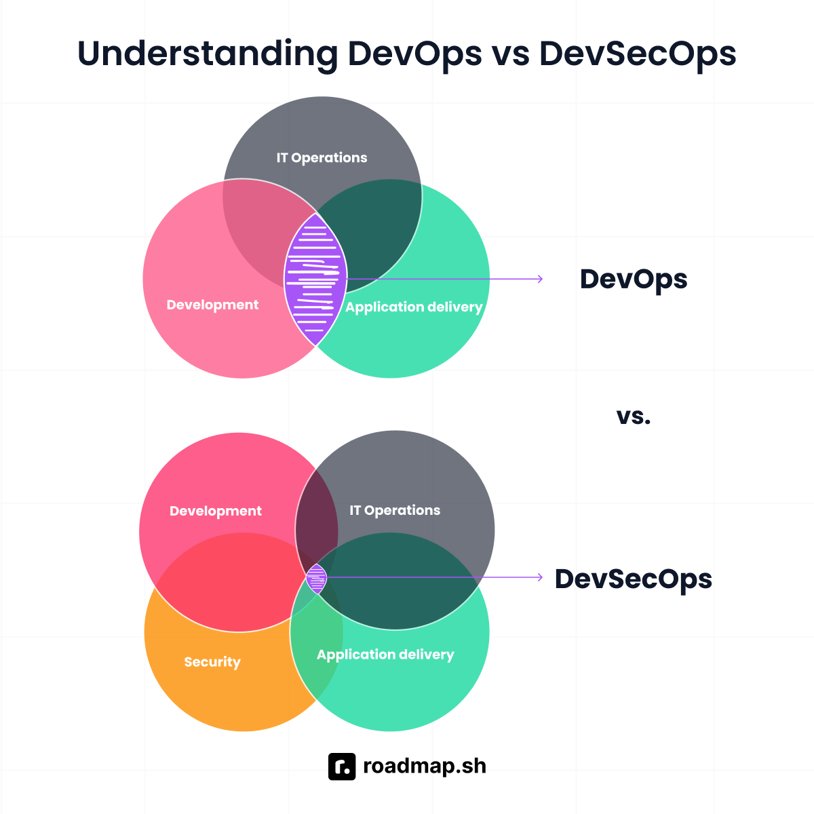

# 🚀 Introduction to DevOps and DevSecOps 🔐

## What is DevOps?

DevOps is a collaborative approach to software delivery that brings together software development and IT operations teams. In many traditional environments, developers are responsible for writing application code, while operations teams are responsible for deploying, hosting, monitoring, and maintaining that application in production. This separation can create silos, where teams work independently and only interact when something needs to be released or fixed.

DevOps aims to remove these silos by encouraging development and operations teams to work together throughout the full software delivery lifecycle. This includes planning, coding, building, testing, releasing, deploying, monitoring, and improving software after it has gone live. Instead of one team “throwing code over the wall” to another team, DevOps promotes shared ownership and shared responsibility.

A major goal of DevOps is to help organisations deliver software faster, more frequently, and more reliably. This is often achieved through automation, collaboration, and continuous feedback. For example, instead of manually testing and deploying applications, teams can use automated pipelines to build, test, and deploy code consistently. This reduces human error, speeds up delivery, and makes releases more predictable.

DevOps also focuses heavily on continuous integration and continuous delivery, often shortened to CI/CD. Continuous integration means developers regularly merge their code changes into a shared repository, where automated tests can check whether the changes work correctly. Continuous delivery means the application can be released safely and repeatedly using automated processes. Together, CI/CD helps teams detect problems earlier and release smaller changes more often.

Another important part of DevOps is infrastructure as code. This means infrastructure such as servers, networks, databases, and cloud resources can be defined using code instead of being configured manually. This makes environments easier to reproduce, review, version-control, and automate. It also helps teams create consistent development, testing, and production environments.

Monitoring and feedback are also key DevOps practices. Once software is running in production, teams use logs, metrics, alerts, and dashboards to understand how the system is performing. This helps teams quickly identify issues, respond to incidents, and learn how users interact with the application. DevOps is not only about deploying software quickly; it is also about continuously improving reliability, performance, and user experience.

## What is DevSecOps?

DevSecOps builds on DevOps by adding security into every stage of the software development lifecycle. The name stands for Development, Security, and Operations. The main idea is that security should not be treated as a separate final step before release. Instead, security should be integrated into the same workflows, tools, and pipelines that development and operations teams already use.

In traditional software delivery, security checks often happen late in the process, sometimes just before deployment or after the application has already been built. This can create problems because vulnerabilities found late are usually harder, slower, and more expensive to fix. A serious security issue discovered near release may delay the project, require major code changes, or create risk if it is ignored.

DevSecOps solves this by making security a continuous and shared responsibility. Developers, operations engineers, security teams, testers, and platform engineers all play a role in protecting the application and its infrastructure. Security becomes part of day-to-day engineering work rather than something handled only by a separate security team at the end.

DevSecOps includes practices such as secure coding, automated security testing, dependency scanning, container image scanning, infrastructure security checks, secrets detection, and compliance validation. These checks can be built into CI/CD pipelines so that security issues are detected automatically whenever code is changed. This allows teams to find and fix problems earlier without completely slowing down delivery.

For example, a DevSecOps pipeline might check whether application dependencies contain known vulnerabilities, whether Docker images include outdated packages, whether secrets such as API keys have accidentally been committed, and whether infrastructure code follows security best practices. These automated checks help teams prevent common security mistakes before they reach production.

The goal of DevSecOps is not to slow teams down. Instead, it helps teams deliver software that is fast, reliable, and secure. By automating security checks and making security part of the normal development process, organisations can reduce risk while still maintaining the speed and flexibility of DevOps.

## What does “Shifting Security Left” mean? ⬅️🔒

“Shifting security left” means moving security activities earlier in the software development lifecycle. The phrase comes from the idea that software delivery is often shown as a timeline moving from left to right: planning and design happen on the left, development and testing happen in the middle, and deployment and production happen on the right.

In a traditional approach, security is often handled on the right side of the timeline, near the end of the process. This might include a final penetration test, manual security review, or compliance check just before release. While these activities are useful, relying only on late-stage security checks can be risky because issues may be discovered after a large amount of work has already been completed.

Shifting security left means introducing security earlier, starting from planning and design. For example, teams can think about security requirements before writing code, identify possible threats during the design stage, and follow secure coding practices during development. Automated tools can then scan the code, dependencies, containers, and infrastructure before the application reaches production.

This approach helps teams catch vulnerabilities when they are easier and cheaper to fix. For example, if a developer introduces an insecure dependency, a dependency scanning tool can detect it during the build process. The developer can then update or replace the dependency before the code is merged or deployed. This is much easier than discovering the same vulnerability after the application is already running in production.

Shifting left also improves security awareness across the team. Developers become more familiar with common risks such as insecure input handling, exposed secrets, weak authentication, vulnerable dependencies, and misconfigured infrastructure. Over time, this helps security become part of the engineering culture rather than a separate checklist.

However, shifting security left does not mean removing security checks later in the lifecycle. Production monitoring, incident response, vulnerability management, runtime protection, and regular audits are still important. A strong DevSecOps approach combines early security testing with ongoing security monitoring after deployment.

## Security can be shifted left in several ways 🛡️⬅️

- During planning, teams can define security requirements, data protection needs, access controls, and compliance expectations.
- During design, teams can perform threat modelling to identify possible attack paths and weaknesses.
- During development, developers can follow secure coding standards and avoid committing secrets into source control.
- During code review, teams can review changes for security risks as well as functionality.
- During the build process, automated tools can scan source code, dependencies, and container images.
- During testing, teams can run security tests alongside functional and performance tests.
- Before deployment, infrastructure as code can be checked for insecure configurations.
- After deployment, teams can monitor logs, alerts, and runtime behaviour for suspicious activity.

These practices help security become part of the normal development workflow rather than a separate activity at the end.

## DevOps vs DevSecOps

DevOps focuses on improving collaboration between development and operations teams. Its main goals are speed, automation, reliability, and continuous improvement. DevOps helps organisations release software more frequently, reduce deployment failures, and respond faster when issues occur.

DevSecOps includes all of those DevOps goals but adds security as a core part of the process. It ensures that security is considered from the beginning and continues throughout development, deployment, and operations. This means teams can move quickly while still protecting applications, infrastructure, and user data.

The main difference is that DevOps asks, “How can we deliver software faster and more reliably?” DevSecOps adds another question: “How can we deliver software faster, more reliably, and more securely?”

In a DevOps environment, a pipeline may build, test, and deploy an application automatically. In a DevSecOps environment, that same pipeline may also check for vulnerable dependencies, insecure code patterns, exposed secrets, container vulnerabilities, and infrastructure misconfigurations. This creates a stronger and safer delivery process.

DevSecOps is especially important in modern cloud environments, where applications are often built using containers, APIs, microservices, open-source libraries, and infrastructure as code. These technologies allow teams to move quickly, but they can also introduce security risks if they are not managed properly. DevSecOps helps teams manage those risks without losing the benefits of fast delivery.

*Figure 1: DevOps focuses on collaboration between development and operations, while DevSecOps expands this model by integrating security throughout the software delivery lifecycle.*
